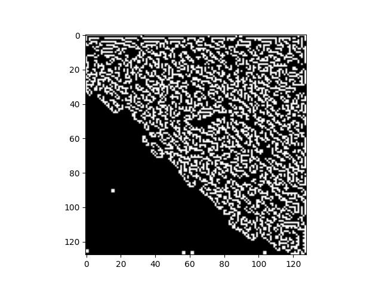
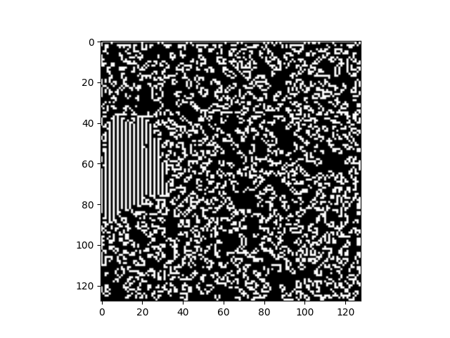
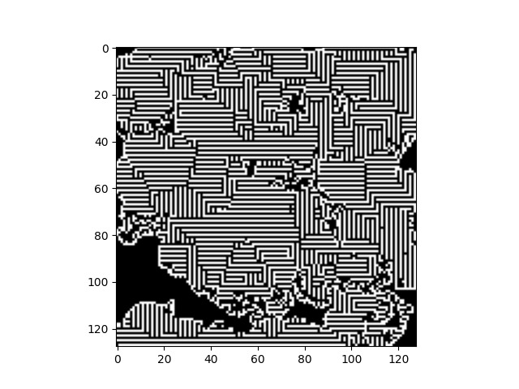

# ConvLife - Convnet implementation of gme of life

An attempt to teach a Convnet differents rulesets for game of life.

## Training

We implemented game of life in pytorch so we can hafe a high troughput of game predictions.  
We firstly tried to have a single convnet that predicts the basic game of life perfectly and then modify the loss to force certain behaviour.

## Different losses an rulesets

We have changed the `MSE` loss slightly to optimize for things like:  

- Balanced live and dead cells
- consistent states
- ...

Loss example:  

```py
def cell_count_MSE(outputs, labels, input):
    # count of dead cells in the output
    output_alive_cells = torch.sum(input == 1, dim=(1,2,3)).float()
    alive_cells = torch.sum(outputs == 1, dim=(1,2,3)).float()
    dead_cells = torch.sum(outputs == 0, dim=(1,2,3)).float()

    log_dead_cell  = torch.mean(torch.log(alive_cells / dead_cells + 1)) / (SIZE*SIZE)
    # step_diff = torch.mean(input - outputs) # ADVANCED_ENEI_PARAM
    # lanoid_fraction = torch.mean(torch.abs(alive_cells - output_alive_cells)) / (SIZE*SIZE)

    mse_loss = nn.MSELoss()(outputs, labels)

    loss = torch.add(mse_loss, ADVANCED_ENEI_PARAM * log_dead_cell )
    return loss
```

This gave some fun and interesting (tho not particularly usefull) stable game states:  





## Model consistency

To improve model consistency, we tried prediting multiple (5) consequitive game states and updating loss after **n** steps instead of just one.  
For more efficient learning, we also introduced LR decay at this point in time.  
Weight decay was also added but we saw no noticable improvements
